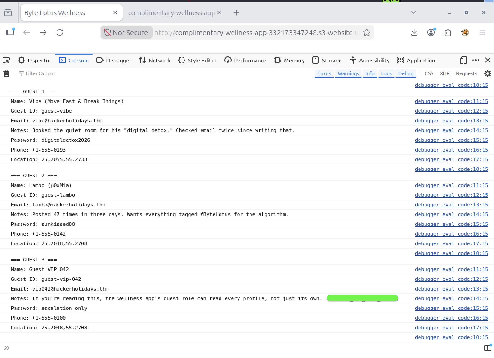
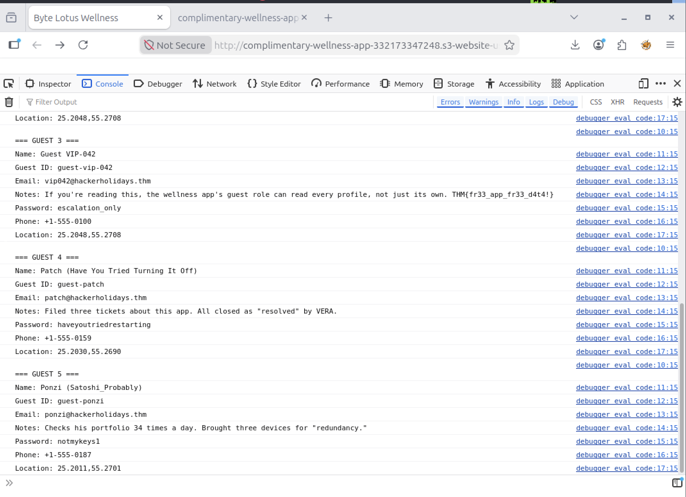

# Byte Lotus Wellness - Complete Writeup

## Challenge Metadata
- **Room Name:** Hacker Holiday - The Byte Lotus Hotel (Complimentary)
- **Difficulty Level:** Easy
- **Category:** Cloud / AWS Security
- **Point Value:** 60 pts
- **Key Topics:** AWS Cognito, IAM Misconfiguration, DynamoDB, Broken Access Control

## The Story

You've just arrived at the Byte Lotus Hotel, a luxury resort in the Middle East. As you check in on their wellness app, something feels off. The app doesn't ask for your password. It doesn't ask you to create an account. It just... loads. And it already knows your name, your preferences, your everything.

The hotel's pitch is clear: "Complimentary access, no friction, no sign-up." But as the briefing notes suggest, **something has to be quietly handing out credentials behind the scenes**. And whatever that something is, it isn't checking very carefully what data it lets you access.

Your mission: Find that mechanism, exploit it, and prove that the hotel's "free" approach to guest data has made it far too generous.

---

## Initial Reconnaissance

### 1. Accessing the Application

I navigated to the vulnerable endpoint:
```
http://complimentary-wellness-app-332173347248.s3-website-us-east-1.amazonaws.com/
```

**First Observations:**
- ✓ The app loads instantly with no login prompt
- ✓ It displays "guest" data (name, loyalty notes)
- ✓ It's hosted on an AWS S3 website
- ✓ The page source is visible and contains AWS SDK code
- ✓ The browser console shows network activity to AWS services

### 2. Network Traffic Analysis

Opening Firefox Developer Tools (F12) and navigating to the **Network** tab revealed the smoking gun:

**Request 1: Cognito Identity Pool**
```
POST https://cognito-identity.us-east-1.amazonaws.com/
X-Amz-Target: AWSCognitoIdentityService.GetCredentialsForIdentity
Status: 200 OK
```

**Request 2: DynamoDB Query**
```
POST https://dynamodb.us-east-1.amazonaws.com/
X-Amz-Target: DynamoDB_20120810.GetItem
Authorization: AWS4-HMAC-SHA256 (Signed with temporary credentials)
Status: 200 OK
```

**The Pattern:** 
1. Browser requests temporary AWS credentials from Cognito
2. Cognito responds with `AccessKeyId`, `SecretKey`, and `SessionToken`
3. Browser uses those credentials to query DynamoDB directly
4. All requests are signed with AWS Signature Version 4

The issue: **These credentials are being issued to an unauthenticated user, and apparently they have broader permissions than just reading the user's own record.**

### 3. Source Code Inspection

Right-clicking → "View Page Source" revealed the frontend application code:

## Deep Dive: Understanding the Architecture

### The Frontend Code

By examining the page source, I found the critical AWS integration code:

```javascript
// AWS Configuration
const IDENTITY_POOL_ID = "us-east-1:836c0949-292d-485b-b532-52d5ca7bb688";
const AWS_REGION = "us-east-1";
const TABLE_NAME = "complimentary-GuestWellnessProfiles";

AWS.config.region = AWS_REGION;

// Generate a unique guest ID (persisted in localStorage)
function guestId() {
  let id = localStorage.getItem("byteLotusGuestId");
  if (!id) {
    // First visit: generate random guest ID like "guest-a7x9k2m1"
    id = "guest-" + Math.random().toString(36).slice(2, 10);
    localStorage.setItem("byteLotusGuestId", id);
  }
  return id;
}

// Request temporary credentials from Cognito Identity Pool
AWS.config.credentials = new AWS.CognitoIdentityCredentials({
  IdentityPoolId: IDENTITY_POOL_ID,
});

// Use those credentials to query DynamoDB
AWS.config.credentials.get(function (err) {
  if (err) {
    console.error("Could not fetch guest credentials:", err);
    return;
  }
  
  const dynamodb = new AWS.DynamoDB({ region: AWS_REGION });
  
  // Request: Fetch only THIS user's record
  dynamodb.getItem({
    TableName: TABLE_NAME,
    Key: { guest_id: { S: guestId() } },
  }, function (err, data) {
    if (err) {
      console.error("Could not load dashboard:", err);
      return;
    }
    renderDashboard(data.Item);
  });
});
```

### How It's Supposed to Work

**The Developer's Intention:**

1. **User visits app** → No login required
2. **Cognito generates credentials** → Temporary AWS access keys valid for ~1 hour
3. **Browser stores credentials** → In `AWS.config.credentials`
4. **App requests user's record** → Uses `dynamodb.getItem()` with the user's guest ID
5. **Display wellness data** → Name, loyalty notes, spa preferences

**The Design Philosophy:** "We'll make credential acquisition frictionless by not requiring login. The app will only query each user's own record, so we don't need strict backend authorization."

### The Critical Flaw

The developers made an assumption: **"The app layer will enforce who can see what, so we can trust the IAM policy to be permissive."**

But they forgot something crucial: **The temporary credentials live in the user's browser, and the AWS SDK is publicly available. An attacker can use those same credentials to make ANY DynamoDB call that the IAM policy allows.**

The backend IAM policy never checks:
- ✗ Whether you're asking for YOUR guest ID or someone else's
- ✗ Whether you have permission to call `Scan` on the entire table
- ✗ Whether you should have access to other guests' passwords and personal data

It only checks: "Do you have temporary credentials from Cognito?" → Yes? → Access granted.

## Exploitation: Step by Step

### Step 1: Access the Developer Console

First, I opened Firefox Developer Tools by pressing **F12**, then navigated to the **Console** tab. 

At this point, the page had already:
- Generated a guest ID and stored it in localStorage
- Requested temporary credentials from Cognito
- Loaded the AWS SDK with valid credentials
- Queried DynamoDB to display my own guest profile

The AWS SDK was fully initialized and ready to use from the console. The temporary credentials were sitting in `AWS.config.credentials`, ready to sign any DynamoDB request.

### Step 2: Craft the Exploit

The key insight: If the app can call `getItem` on behalf of the user, then the user (with their temporary credentials) should be able to call anything the IAM policy permits.

I decided to test whether the policy allowed a `Scan` operation on the entire table. The `Scan` operation in DynamoDB returns all items, regardless of partition key. If allowed, it would dump all guest records.

### Step 3: Execute the Scan

In the console, I created a new DynamoDB client and issued a `Scan` request:

```javascript
const db = new AWS.DynamoDB({ region: "us-east-1" });

db.scan({
  TableName: "complimentary-GuestWellnessProfiles"
}, function(err, data) {
  if (err) {
    console.log("Error:", err);
  } else {
    data.Items.forEach((item, index) => {
      console.log(`\n=== GUEST ${index + 1} ===`);
      console.log("Name:", item.name.S);
      console.log("Guest ID:", item.guest_id.S);
      console.log("Email:", item.email.S);
      console.log("Notes:", item.notes.S);
      console.log("Password:", item.password.S);
      console.log("Phone:", item.phone.S);
      console.log("Location:", item.location.S);
    });
  }
});
```

**Result: SUCCESS.** No error. The scan returned all 5 guest records. 




This confirmed the vulnerability: **The IAM policy for the Cognito guest role allowed `dynamodb:Scan` on the entire guest wellness table without any restrictions.**

### Step 4: Analyze the Results

The scan returned 5 guest records. Here's what I found (with sensitive data masked):


### Step 5: Extracting the Flag

Guest VIP-042's notes field contained a meta-commentary on the vulnerability itself, **along with the flag:**

```
If you're reading this, the wellness app's guest role can read every profile, 
not just its own. THM{fr33_app_fr33_d4t4!}
```

The flag was deliberately placed there by the challenge creator to guide you toward understanding the exploit.

## The Flag

```
THM{fr33_app_fr33_d4t4!}
```

**Interpretation:** "Free app, free data!" — A commentary on how "free" and "frictionless" services often trade user privacy for convenience.

---

## Technical Analysis: What Went Wrong

### The Vulnerability Chain

This exploit leverages **multiple architectural failures working together:**

#### 1. **Overly Permissive IAM Policy**

The Cognito Identity Pool's guest role likely has a policy that looks something like:

```json
{
  "Version": "2012-10-17",
  "Statement": [
    {
      "Effect": "Allow",
      "Action": [
        "dynamodb:GetItem",
        "dynamodb:Scan",
        "dynamodb:Query"
      ],
      "Resource": "arn:aws:dynamodb:us-east-1:*:table/complimentary-GuestWellnessProfiles"
    }
  ]
}
```

**Problems:**
- ✗ `Scan` permission allows reading **all** records
- ✗ `Query` permission with no restrictions
- ✗ No conditions limiting access to the user's own records
- ✗ No `Condition` block using `dynamodb:LeadingKeys`

#### 2. **Credentials Exposed in Browser**

The AWS SDK runs in the browser, which means:
- ✓ The application can use the credentials (intended)
- ✗ **Any JavaScript in the page can use the credentials** (not intended)
- ✗ An attacker can paste custom code in the console and sign requests
- ✗ Browser extensions, malicious scripts, or social engineering could steal these credentials

#### 3. **No Server-Side Authorization**

The developers relied on **client-side authorization:**
- "The app will only call `getItem` with the user's own guest ID"
- "We don't need backend validation because the frontend enforces it"

**Why this fails:**
- Client-side code can be modified, bypassed, or audited
- Temporary credentials are real and valid—they don't care where the request comes from
- An attacker doesn't need to modify the app; they can just use the credentials directly

#### 4. **Broken Access Control (OWASP A01)**

Even though each guest has a unique guest ID (like `guest-vibe`), there's nothing preventing guest-1 from accessing guest-2's record. The authorization model is:

```
"Do you have Cognito credentials?" → Yes → "Access everything"
```

Instead of:

```
"Do you have Cognito credentials?" → Yes → "What resource are you accessing?" 
→ "Is it YOUR record?" → "Yes" → "Access granted"
```

### Why the Developers Made This Mistake

**Likely reasoning:**
1. "We want a frictionless sign-up experience"
2. "Let's use Cognito to hand out credentials without login"
3. "The app is public-facing, so let's make the policy permissive"
4. "The app code controls what gets queried, so we're safe"
5. "We can add proper auth later"

**What they missed:**
- Credentials are credentials—they're valid regardless of who uses them
- "Later" never comes, and shortcuts become permanent
- Permissive policies are hard to fix once users rely on them

---

## AWS Security Concepts Explained

### What is Cognito Identity Pool?

An **Identity Pool** is AWS's way of handing out temporary, limited credentials to users without requiring them to have AWS accounts.

**Typical use case:** A mobile app needs to access S3 to upload photos, but you don't want to embed permanent AWS credentials in the app binary.

**How it works:**
1. App calls `GetCredentialsForIdentity`
2. Cognito returns: `{ AccessKeyId, SecretAccessKey, SessionToken }`
3. App uses these to sign requests (e.g., S3 PutObject)
4. Credentials expire after ~1 hour
5. App requests new credentials when they expire

**Security model:** The IAM policy attached to the Identity Pool's role determines what those credentials can access.

### What is DynamoDB?

**DynamoDB** is AWS's managed NoSQL database. Unlike SQL databases with fine-grained access controls, DynamoDB relies entirely on IAM for authorization.

**Key operations:**
- `GetItem` — Fetch a single record by primary key
- `Query` — Fetch multiple records matching a partition key
- `Scan` — Fetch **all** records in the table
- `PutItem`, `UpdateItem`, `DeleteItem` — Write operations

**Critical point:** DynamoDB doesn't know about "users" or "ownership." It only knows about IAM policies. If an IAM policy says `dynamodb:Scan`, then that principal can scan.

---

## Detailed Walkthrough of the Attack

### What Happens Behind the Scenes

**Timeline:**

| Step | Action | Result |
|------|--------|--------|
| 1 | User visits the S3-hosted app | Browser loads HTML + JavaScript |
| 2 | App code runs | AWS SDK is initialized |
| 3 | App calls `CognitoIdentityCredentials.get()` | Browser sends: `GetCredentialsForIdentity` |
| 4 | Cognito validates the Identity Pool ID | Cognito recognizes the pool as valid |
| 5 | Cognito returns temporary credentials | Browser receives AccessKeyId, SecretKey, SessionToken |
| 6 | App calls `dynamodb.getItem()` | Browser signs the request with the credentials |
| 7 | DynamoDB receives the request | DynamoDB checks the IAM policy |
| 8 | IAM policy allows `dynamodb:GetItem` | Request is approved ✓ |
| 9 | DynamoDB returns the user's record | Browser displays the data |
| **EXPLOITATION BEGINS** | | |
| 10 | Attacker opens console | Attacker has access to the same credentials |
| 11 | Attacker calls `dynamodb.scan()` | Browser signs the request with the credentials |
| 12 | DynamoDB receives the scan request | DynamoDB checks the IAM policy |
| 13 | IAM policy allows `dynamodb:Scan` | Request is approved ✓ |
| 14 | DynamoDB returns all records | Attacker gets all guest data, including flag |

**The root cause:** At no point does DynamoDB, the IAM policy, or Cognito ask: "Is this user authorized to scan the entire table?" They only ask: "Are these credentials valid?" ✓

---

## What the Challenge Teaches

### The Core Lesson: Defense in Depth

**Never rely on a single layer of security.**

| Layer | This Challenge | Better Approach |
|-------|---|---|
| Application | Trusts users to only query their own record | Validates every request server-side |
| Database | Trusts the IAM policy | Also has row-level security |
| Authentication | Assumes Cognito credentials are enough | Adds session validation, rate limiting |
| Network | Trusts HTTPS | Adds IP whitelisting, VPC isolation |

### Real-World Impact

This type of vulnerability has affected real companies:
- **Misconfigured S3 buckets** exposing millions of records
- **Overly permissive Lambda execution roles** leading to privilege escalation
- **Public database snapshots** exposing entire customer databases

The pattern is always: "We secured one layer and assumed the others would be fine."

---

## Remediation: How to Fix This

### Quick Fix (For This Challenge)

```json
{
  "Version": "2012-10-17",
  "Statement": [
    {
      "Effect": "Allow",
      "Action": "dynamodb:GetItem",
      "Resource": "arn:aws:dynamodb:us-east-1:*:table/complimentary-GuestWellnessProfiles",
      "Condition": {
        "ForAllValues:StringEquals": {
          "dynamodb:LeadingKeys": ["${aws:username}"]
        }
      }
    }
  ]
}
```

**What this does:**
- Allows `GetItem` only (removes `Scan` and `Query`)
- Only works if the partition key (`guest_id`) matches the username
- Each Cognito identity gets a unique username

**Result:** Even if the attacker calls `Scan`, it fails with an "Access Denied" error.

### Proper Fix (Production Environment)

1. **Add a backend API**
   - Frontend calls your API, not DynamoDB directly
   - API validates the request and applies business logic
   - API uses an IAM role with minimal permissions

2. **Implement authentication**
   - Use Cognito User Pools (not just Identity Pools)
   - Require users to log in with a password
   - Issue session tokens that represent authenticated identity

3. **Add logging and monitoring**
   - Enable CloudTrail to audit all DynamoDB calls
   - Set up CloudWatch alarms for unusual patterns
   - Monitor for mass data access (scanning entire tables)

4. **Encrypt sensitive data**
   - Use DynamoDB encryption at rest
   - Encrypt passwords with bcrypt (don't store plaintext!)
   - Use TLS for all data in transit

5. **Implement rate limiting**
   - Limit queries per user per minute
   - Reject scanning operations from frontend code
   - Require authentication for bulk access

---

## Key Takeaways

| Concept | Lesson |
|---------|--------|
| **IAM is your database firewall** | Restrict it ruthlessly. Only grant what's needed. |
| **Credentials in browsers are risky** | Frontend code can be inspected, modified, and exploited. |
| **Client-side security is theater** | Authentication and authorization must happen server-side. |
| **"Frictionless" doesn't mean "Secure"** | Every convenience is a potential security tradeoff. |
| **Test your assumptions** | Don't assume the IAM policy will enforce your business logic. |
| **Defense in Depth saves the day** | Multiple layers catch what one layer misses. |

---

## Conclusion

The Byte Lotus Wellness app demonstrates a common pitfall in cloud-native development: **delegating authorization to infrastructure instead of implementing it in code.**

The app assumed that AWS would magically prevent guests from accessing each other's data—but AWS can only enforce what the IAM policy allows, and the policy was too permissive.

**The fix isn't complicated**, but it requires developers to:
1. Question their assumptions
2. Implement authorization at every layer
3. Test their security assumptions (like this challenge did!)
4. Accept that "free" and "frictionless" require compensating controls

**One last thought:** The flag itself is a hint— `THM{fr33_app_fr33_d4t4!}` means **"Free app, free data!"** It's a reminder that when a service is free and requires no login, you're usually the product, and your data is the payment.

---

## Author
```bash
  Vasudha Padala
  Master in Computer Science
  University of Southern California
```

